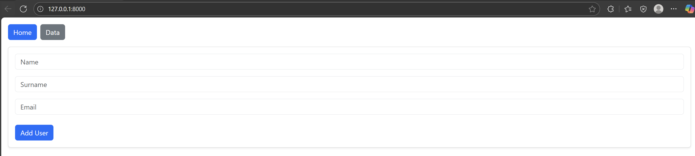
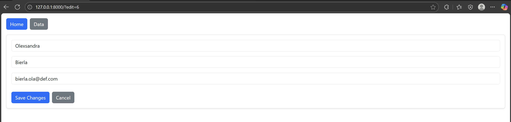
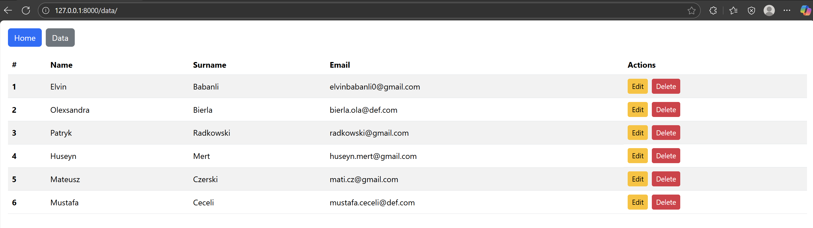

# Django CRUD (Contacts)

A small **Django CRUD** application for portfolio and recruiter review.  
The app allows users to create, read, update and delete contact data.

---

## ✅ Tech Stack

- **Backend:** Django (MVT pattern)
- **Frontend:** HTML + Bootstrap
- **Database:** SQLite (default)
- **Python:** 3.10+

---

## 🧩 OOP Usage

- **Encapsulation** – data and logic are stored inside the `Contact` model  
- **Inheritance** – model inherits from `django.db.models.Model`
- **Separation of concerns** – views handle logic, templates handle UI

---

## ✨ Features

- Create / list / edit / delete contacts
- Simple and clean structure
- Server-side validation
- Easy to extend

---

## 📸 Screenshots

Home  


Edit  


List  


---

## 🚀 How to Run

```bash
pip install django
python manage.py migrate
python manage.py runserver
